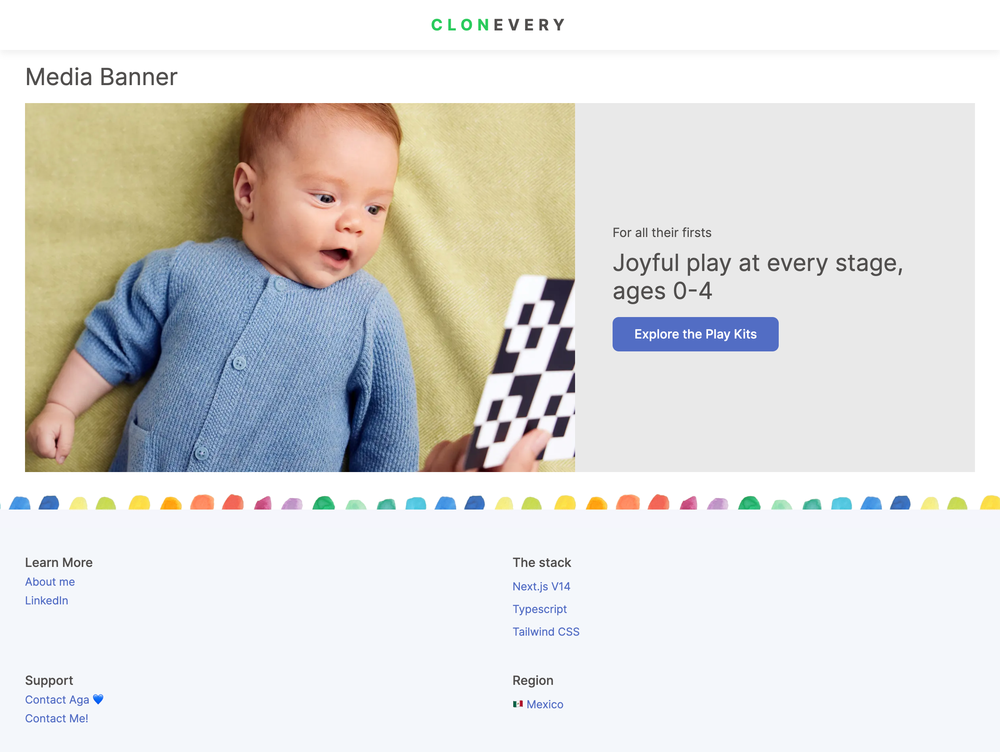

This repository contains the Lovevery Frontend take-home challenge. This activity is open-ended without a right or wrong answer; it's only meant to gauge your approach to frontend problem solving. Relax, take your time, and have fun.

## Setup

This repository contains a Next.js application generated via `create-next-app`.

```bash
$   npm install      # install dependencies
$   npm run dev      # run locally
$   npm run test      # run locally
$   npm run storybook     # run locally
```

Open [http://localhost:3000](http://localhost:3000) with your browser to see the result.

## Prompt

The goal of this exercise is to build a reusable React component and to place it on a test page. The mockup details two different components to choose from: the MediaBanner and the ItemRow. The mockup provides a general layout, a color palette, and expected behavior on various screen sizes. Your task is to build one of these components in a reusable manner, to leverage the hook at `src/useData`, and to render the component on the page at `src/page`. Please use both TypeScript and Tailwind CSS to build your solution.

## Mockups

<details>
  <summary>MediaBanner</summary>


</details>

<details>
  <summary>ItemRow</summary>


</details>

## Results

<details>
  <summary>ItemRow</summary>



</details>

## Scoring

This activity is intentionally open-ended and aims to gauge your general approach to React development. The following themes will be considered during review:

1. Code organization
1. Data variations
1. Responsiveness
1. Type-safety
1. Testing

## Submission

Once you're done, please email us with an archive of your repository.
